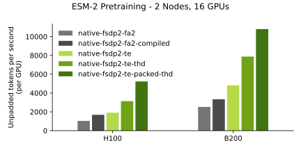

<div align="center">
  <h1>BioNeMo Framework</h1>
  <h4>GPU-optimized recipes & toolkits for training transformer models at scale with biological data</h4>
</div>

<div align="left">

[](https://console.brev.dev/launchable/deploy/now?launchableID=env-2pPDA4sJyTuFf3KsCv5KWRbuVlU)
[](https://nvidia.github.io/bionemo-framework)
[](https://github.com/NVIDIA/bionemo-framework/actions/workflows/unit-tests.yml)
[](https://catalog.ngc.nvidia.com/orgs/nvidia/teams/clara/containers/bionemo-framework/tags)
[](https://codecov.io/gh/NVIDIA/bionemo-framework)

<div align="left">

NVIDIA BioNeMo Framework is a comprehensive suite of programming tools, libraries, and models designed for digital biology. It accelerates the most time-consuming and costly stages of building and adapting biomolecular AI models by providing domain-specific, optimized model recipes and tooling that are easily integrated into GPU-based computational resources with state-of-the-art performance.

<p align="center">
  
  <br>
  <em> Training benchmarks for ESM-2, a well known protein sequence model using the BERT architecture.</em>
</p>

## ⚡ Quick Start

```bash
# Try BioNeMo Recipes in Google Colab (Recommend A100, may be too slow or run out of memory on T4)
# Copy paste into Google Colab cells

!git clone https://github.com/NVIDIA/bionemo-framework.git
cd bionemo-framework/bionemo-recipes/recipes/esm2_native_te/

# Install transformer_engine[pytorch] from source, it takes a long time to install from PYPI
!curl -L -o transformer_engine_torch-2.8.0-cp312-cp312-linux_x86_64.whl "https://drive.google.com/uc?export=download&id=1Oz6dkkIMahv3LN_fQhhQRolZ3m-sr9SF"
!pip install --no-build-isolation transformer-engine transformer_engine_torch-2.8.0-cp312-cp312-linux_x86_64.whl

# Install dependencies
!pip install -r requirements.txt

# Run ESM2 Native Recipes with TE
!python train_ddp.py
```

## Recent News

- 10/27/2025 [CodonFM recipe](https://github.com/NVIDIA/bionemo-framework/tree/main/bionemo-recipes/recipes/codonfm_ptl_te) released! This is an accelerated version of the original [research codebase](https://github.com/NVIDIA-Digital-Bio/CodonFM) with [scientific preprint](https://research.nvidia.com/labs/dbr/assets/data/manuscripts/nv-codonfm-preprint.pdf).
- 09/30/2025 Megatron/NeMo 5D parallel BioNeMo Framework image v2.7 [released on NGC](https://catalog.ngc.nvidia.com/orgs/nvidia/teams/clara/containers/bionemo-framework) for both x86 and ARM CPUs.
- 09/01/2025 [bionemo-recipes](https://github.com/NVIDIA/bionemo-framework/tree/main/bionemo-recipes) goes live! Lightweight and portable examples with state-of-the-art training performance you can riff on to meet your needs.

## Code Overview

A core use-case of the BioNeMo Framework is to help digital biology scientists accelerate and scale their model training onto a compute cluster. This repository contains 3 categories of modules for this use-case:

1\. Models using **fully-sharded-data-parallel (FSDP)**, which is possible with a number of different implementations including [PyTorch’s FSDP2/FSDP1](https://docs.pytorch.org/tutorials/intermediate/FSDP_tutorial.html) and [NVIDIA megatron-FSDP](https://github.com/NVIDIA/Megatron-LM/tree/main/megatron/core/distributed/fsdp/src). Sharding a model with FSDP typically requires only a few lines of code changes. You can find models and ready-to-run recipes parallelized with megatron-FSDP and accelerated with [NVIDIA TransformerEngine (TE)](https://github.com/NVIDIA/TransformerEngine) in [`bionemo-recipes`](./bionemo-recipes/).

<details>
<summary><b>(Click to expand) <code>bionemo-recipes</code> support matrix </b></summary>
<small>

| Directory                                      | Description                                                                                                                   | Support Status | 5D Parallel | Megatron-FSDP | TE     | Sequence Packing | FP8    | Context Parallelism |
| ---------------------------------------------- | ----------------------------------------------------------------------------------------------------------------------------- | -------------- | ----------- | ------------- | ------ | ---------------- | ------ | ------------------- |
| `models/`<br>`amplify`                         | TE accelerated protein BERT, pushed to HuggingFace                                                                            | ✅ Active      | ❌          | ✅            | ✅     | 🚧 WIP           | ✅     | 🚧 WIP              |
| `models/`<br>`esm2`                            | TE accelerated protein BERT, pushed to HuggingFace                                                                            | ✅ Active      | ❌          | ✅            | ✅     | ✅               | ✅     | 🚧 WIP              |
| `models/`<br>`geneformer`                      | TE accelerated single-cell BERT                                                                                               | 🚧 WIP         | ❌          | ✅            | 🚧 WIP | 🚧 WIP           | 🚧 WIP | 🚧 WIP              |
| `recipes/`<br>`codonfm_ptl_te`                 | Recipe for [CodonFM](https://research.nvidia.com/labs/dbr/assets/data/manuscripts/nv-codonfm-preprint.pdf)'s Encodon using TE | ✅ Active      | ❌          | 🚧 WIP        | ✅     | ✅               | 🚧 WIP | 🚧 WIP              |
| `recipes/`<br>`esm2_accelerate_te`             | Recipe for ESM2 TE + HF Accelerate                                                                                            | ✅ Active      | ❌          | 🚧 WIP        | ✅     | ❌               | ✅     | 🚧 WIP              |
| `recipes/`<br>`esm2_native_te`                 | Recipe for ESM2 TE + native PyTorch                                                                                           | ✅ Active      | ❌          | ✅            | ✅     | ✅               | ✅     | 🚧 WIP              |
| `recipes/`<br>`geneformer_native_te_mfsdp_fp8` | Recipe for Geneformer HF model                                                                                                | 🚧 WIP         | ❌          | ✅            | ✅     | ❌               | ✅     | 🚧 WIP              |
| `recipes/`<br>`vit`                            | Recipe for Vision Transformer                                                                                                 | 🚧 WIP         | ❌          | ✅            | ✅     | ❌               | ✅     | 🚧 WIP              |

</small>

</details>

2\. Models using explicit **5D parallelism** (tensor parallel, pipeline parallel, context parallel, etc.), for which NVIDIA provides accelerated support with [NeMo](https://github.com/NVIDIA-NeMo/NeMo) and [Megatron-Core](https://github.com/NVIDIA/Megatron-LM). 5D parallelism requires explicit modification of the model code to make it shardable along different dimensions. The models for this style of acceleration and parallelism can be found in the `sub-packages` directory. While it is possible to pip install the models, we strongly suggest using our [Docker image](https://catalog.ngc.nvidia.com/orgs/nvidia/teams/clara/containers/bionemo-framework) that comes with NeMo and Megatron-Core pre-installed.

<details>
<summary><b>(Click to expand) <code>sub-packages</code> models support matrix</b></summary>
<small>

| Directory               | Description                      | Support        | 5D Parallel | Megatron-FSDP | TE  | Sequence Packing | FP8 | Context Parallel |
| ----------------------- | -------------------------------- | -------------- | ----------- | ------------- | --- | ---------------- | --- | ---------------- |
| `bionemo-core`          | Model Config/test data utils     | ✅ Active      | ✅          | N/A           | ✅  | ❌               | N/A | N/A              |
| `bionemo-evo2`          | 5D parallel model                | ✅ Active      | ✅          | ❌            | ✅  | ❌               | ✅  | ✅               |
| `bionemo-example_model` | Example 5D parallel model        | 🔧 Maintenance | ✅          | ❌            | ✅  | ❌               | ✅  | ✅               |
| `bionemo-geneformer`    | 5D parallel model                | 🔧 Maintenance | ✅          | ❌            | ✅  | ❌               | ✅  | ✅               |
| `bionemo-llm`           | 5D parallel base model (BioBert) | ✅ Active      | ✅          | ❌            | ✅  | ✅               | ✅  | ✅               |
| `bionemo-testing`       | Testing Utilities                | ✅ Active      | ✅          | N/A           | N/A | N/A              | N/A | N/A              |

</small>
</details>

3\. Tooling for dataloading and in-the-training-loop processing, which are lightweight and individually pip installable. These are also in the `sub-packages` directory adjacent to the 5D parallel models.

<details>
<summary><b>(Click to expand) <code>sub-packages</code> tooling support matrix</b></summary>
<small>

| Directory                     | Description                                | Support        | 5D Parallel   | Megatron-FSDP | TE  | Sequence Packing | FP8 | Context Parallel |
| ----------------------------- | ------------------------------------------ | -------------- | ------------- | ------------- | --- | ---------------- | --- | ---------------- |
| `bionemo-moco`                | Molecular Co-design tools                  | ✅ Active      | ❌            | N/A           | N/A | N/A              | N/A | N/A              |
| `bionemo-noodles`             | Python API to fast FASTA file I/O          | 🔧 Maintenance | ❌            | N/A           | N/A | N/A              | N/A | N/A              |
| `bionemo-scspeedtest`         | Single Cell Dataloading benchmark tests    | ✅ Active      | N/A           | N/A           | N/A | N/A              | N/A | N/A              |
| `bionemo-size-aware-batching` | Memory consumption aware batching          | 🔧 Maintenance | N/A           | N/A           | N/A | N/A              | N/A | N/A              |
| `bionemo-scdl`                | Modular Single Cell Data Loader            | ✅ Active      | ✅ Compatible | N/A           | N/A | N/A              | N/A | N/A              |
| `bionemo-webdatamodule`       | PyTorch Lightning module to use WebDataset | 🔧 Maintenance | N/A           | N/A           | N/A | N/A              | N/A | N/A              |

</small>
</details>

BioNeMo Framework is part of a larger ecosystem of NVIDIA Biopharma products. Get notified of new releases, bug fixes, critical security updates, and more for biopharma. [Subscribe.](https://www.nvidia.com/en-us/clara/biopharma/product-updates/)

## Documentation Resources

- **Official Documentation:** Contents of `sub-packages` including user guides, API references, and troubleshooting, are documented on our [official documentation](https://docs.nvidia.com/bionemo-framework/latest/). Nightly builds of this documentation is available on [BioNeMo Framework GitHub Pages](https://nvidia.github.io/bionemo-framework/)

- **🚧 In-Progress Documentation 🚧:** `bionemo-recipes` documentation is currently work in progress, however the recipes are meant to be self-documented and easy to understand—we suggest you throw them into your favorite genai code assistant!

## Getting Started with BioNeMo Framework - 5D Parallelism with NeMo/Megatron implementations

:warning: **(This section is not relevant for bionemo-recipes)**

Full documentation on using the BioNeMo Framework is provided in our documentation:
<https://docs.nvidia.com/bionemo-framework/latest/user-guide/>. To simplify the integration of optimized third-party dependencies, BioNeMo is primarily distributed as a containerized library. You can download the latest released container for the BioNeMo Framework from
[NGC](https://catalog.ngc.nvidia.com/orgs/nvidia/teams/clara/containers/bionemo-framework). To launch a pre-built container, you can use the brev.dev launchable [](https://console.brev.dev/launchable/deploy/now?launchableID=env-2pPDA4sJyTuFf3KsCv5KWRbuVlU) or execute the following command:

```bash
docker run --rm -it \
  --gpus=all --ipc=host --ulimit memlock=-1 --ulimit stack=67108864 \
  nvcr.io/nvidia/clara/bionemo-framework:nightly \
  /bin/bash
```

### Setting up a local development environment

#### Initializing 3rd-party dependencies as git submodules

The NeMo and Megatron-LM dependencies are included as git submodules in bionemo2. The pinned commits for these submodules represent the "last-known-good" versions of these packages
that are confirmed to be working with bionemo2 (and those that are tested in CI).

To initialize these sub-modules when cloning the repo, add the `--recursive` flag to the git clone command:

```bash
git clone --recursive git@github.com:NVIDIA/bionemo-framework.git
cd bionemo-framework
```

To download the pinned versions of these submodules within an existing git repository, run

```bash
git submodule update --init --recursive
```

Different branches of the repo can have different pinned versions of these third-party submodules. Ensure submodules are automatically updated after switching branches or pulling updates by configuring git with:

```bash
git config submodule.recurse true
```

**NOTE**: this setting will not download **new** or remove **old** submodules with the branch's changes.
You will have to run the full `git submodule update --init --recursive` command in these situations.

#### Build the Docker Image Locally

With a locally cloned repository and initialized submodules, build the BioNeMo container using:

```bash
docker buildx build . -t my-container-tag
```

If you see an error message like `No file descriptors available (os error 24)`, add the option `--ulimit nofile=65535:65535` to the docker build command.

#### VSCode Devcontainer for Interactive Debugging

We distribute a [development container](https://devcontainers.github.io/) configuration for vscode
(`.devcontainer/devcontainer.json`) that simplifies the process of local testing and development. Opening the
bionemo-framework folder with VSCode should prompt you to re-open the folder inside the devcontainer environment.

> [!NOTE]
> The first time you launch the devcontainer, it may take a long time to build the image. Building the image locally
> (using the command shown above) will ensure that most of the layers are present in the local docker cache.

### Quick Start

See the [tutorials pages](https://docs.nvidia.com/bionemo-framework/latest/user-guide/examples/bionemo-esm2/pretrain/)
for example applications and getting started guides.
