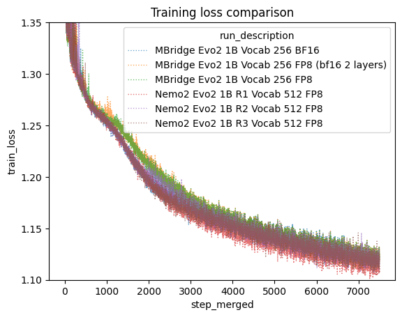

# Evo2 Recipe

This recipe is work-in-progress rewrite of the nemo2 based bionemo/evo2 package into a self-contained
training repository that makes use of megatron bridge.

## Installation

```
# 1. Create venv (CRITICAL: include system packages so it sees the container's PyTorch)
export UV_LINK_MODE=copy
uv venv --system-site-packages --seed /workspace/.venv

# 2. Activate the environment
source /workspace/.venv/bin/activate
pip freeze | grep transformer_engine > pip-constraints.txt
uv pip install -r build_requirements.txt --no-build-isolation  # some extra requirements are needed for building
uv pip install -c pip-constraints.txt -e . --no-build-isolation
```

## Usage

### Example job

```
# 3. Run an example job
## 2. if on a6000s, you may need to disable p2p to avoid crashing
export NCCL_P2P_DISABLE=1
## 3. Run the job:
torchrun --nproc-per-node 2 --no-python \
  train_evo2 \
  --hf-tokenizer-model-path tokenizers/nucleotide_fast_tokenizer_256 \
  --model-size striped_hyena_1b_nv_parallel --max-steps 12 --eval-interval 10 \
  --eval-iters 3 --mock-data \
  --micro-batch-size 16 --global-batch-size 32 --seq-length 1024 \
  --tensor-model-parallel 1 \
  --use-precision-aware-optimizer --dataset-seed 33 \
  --seed 41 --spike-no-more-embedding-init \
  --no-weight-decay-embeddings --cross-entropy-loss-fusion \
  --align-param-gather --overlap-param-gather  --grad-reduce-in-fp32 \
  --decay-steps 100 --warmup-steps 10 \
  --mixed-precision-recipe bf16_with_fp8_current_scaling_mixed \
  --no-fp32-residual-connection --activation-checkpoint-recompute-num-layers 1 \
  --attention-dropout 0.001 --hidden-dropout 0.001 \
  --eod-pad-in-loss-mask --enable-preemption \
  --log-interval 5 --debug-ddp-parity-freq 10 \
  --result-dir tmpfp8 --no-renormalize-loss
```

### Example fine-tune from an existing checkpoint

First convert the checkpoint from nemo2 format (temporary step until we upload the new files)

Good checkpoint names to try are:

- evo2/1b-8k-bf16:1.0 (model_size: 1b)
- evo2/7b-1m:1.0 (model_size: 7b_arc_longcontext)
- evo2/40b-1m-fp8-bf16:1.0 (model_size: 40b_arc_longcontext)

Other than the 7b version, the other two are checkpoints fine-tuned by the BioNeMo team to support both FP8 and BF16
precision. The 7b version worked well on both FP8 and BF16 out of the box so it was not fine-tuned further. If you do
want to use one of the FP8 sensitive checkpoints, like `evo2/40b-1m` then be sure to add the `--vortex-style-fp8`
option to the checkpoint conversion step below. Also note that although 8k versions of the 7b and 40b checkpoints exist,
it is advisable to use the longer context versions since they were trained further and still run on shorter inputs.

See `download_bionemo_data --list-resources` for other checkpoint options and a list of available
downloadable resources.

```
CKPT_NAME=evo2/1b-8k-bf16:1.0
CKPT_OUT_DIR=evo2_1b_8k_bf16_mbridge
evo2_convert_nemo2_to_mbridge \
  --mixed-precision-recipe bf16_with_fp8_current_scaling_mixed \
  --tokenizer-path tokenizers/nucleotide_fast_tokenizer_512 \
  --model-size 1b \
  --seq-length 8192 \
  --nemo2-ckpt-dir $(download_bionemo_data $CKPT_NAME) \
  --mbridge-ckpt-dir $CKPT_OUT_DIR

```

Now run like before, but include the fine-tuned checkpoint directory you converted in the previous step with
`--finetune-ckpt-dir $CKPT_OUT_DIR`. Also if you have problems with `bf16_with_fp8_current_scaling_mixed` try
`bf16_mixed`.

```
torchrun --nproc-per-node 2 --no-python \
  train_evo2 \
  --hf-tokenizer-model-path tokenizers/nucleotide_fast_tokenizer_512 \
  --model-size 1b --max-steps 12 --eval-interval 10 \
  --eval-iters 3 --mock-data \
  --micro-batch-size 16 --global-batch-size 32 --seq-length 1024 \
  --tensor-model-parallel 1 \
  --use-precision-aware-optimizer --dataset-seed 33 \
  --seed 41 \
  --cross-entropy-loss-fusion \
  --align-param-gather --overlap-param-gather  --grad-reduce-in-fp32 \
  --decay-steps 100 --warmup-steps 10 \
  --mixed-precision-recipe bf16_with_fp8_current_scaling_mixed \
  --no-fp32-residual-connection --activation-checkpoint-recompute-num-layers 1 \
  --attention-dropout 0.001 --hidden-dropout 0.001 \
  --eod-pad-in-loss-mask --enable-preemption \
  --log-interval 5 --debug-ddp-parity-freq 10 \
  --result-dir tmpfp8-ft-example --no-renormalize-loss \
  --finetune-ckpt-dir $CKPT_OUT_DIR
```

## Where do the custom command line programs come from?

See `pyproject.toml` for where runnable programs like `train_evo2` and `evo2_convert_nemo2_to_mbridge` are implemented
in code.

## Docker build

```
docker build -t evo2_megatron_recipe-$(git rev-parse --short HEAD) .
```

## Performance and accuracy comparisons

NOTE: this section is largely a work in progress. This reflects the most updated information, but may not reflect the
current state of the code base at any given time.

### Training accuracy convergence

We ran a 12 hour 48 H100 GPU training run to compare megatron bridge with nemo2. We found that FP8 current scaling
converges by around the 5,000th step to the bf16 lines. And that bf16 is comparable with nemo2. Interestingly in nemo2
bf16 and fp8 followed nearly identical trajectories for the first 5k steps as well. Note that in a typical training run
we are performing over 100k steps, so different behavior in the first 5k steps is less worrisome if the endpoints are
comparable.



### Training performance comparisons

FP8 current scaling which is supposed to have better convergence properties than delayed scaling, performs nearly as
well as delayed scaling in mbridge. Even leaving multiple transformer layers in bf16 precision trains faster than fp8
delayed scaling in nemo2.

|                   Evo2 1B Run                    | Seconds per step (lower is better) | Tokens/sec/GPU | Global Batch Size | Number of GPUs | Vocab Size |
| :----------------------------------------------: | :--------------------------------: | :------------: | :---------------: | :------------: | :--------: |
|                   MBridge BF16                   |                6.10                |     26,859     |        960        |       48       |    256     |
|              MBridge FP8 (delayed)               |                5.38                |     30,453     |        960        |       48       |    256     |
|              MBridge FP8 (current)               |                5.44                |     28,755     |        960        |       48       |    512     |
| MBridge FP8 (current first/last two layers bf16) |                5.47                |     28,598     |        960        |       48       |    512     |
|               Nemo2 FP8 (delayed)                |                6.18                |     26,511     |        960        |       48       |    512     |

Activation memory optimizations have enabled context parallelism to work better with evo2 style models in our mbridge
implementation than the previous nemo2 implementation. Since TP requires more node to node communication, you generally
want to limit TP to your fastest interconnects, which are typically configured in nodes of 8 GPUs. Evo2 would previously
OOM with these more ideal configurations, requiring much larger than typical levels of TP to handle long context
training. With our latest changes to the evo2 forward pass, we can now handle more typical TP vs CP configurations.
This enables significantly faster step timing at long context, as well as demonstrating up to 2M context length. We
have currently demonstrated small training runs at 2M context on only 512 H100 GPUs for the 40b parameter model.

|   Configuration   |  Precision  | TP  | CP  | Number of Nodes | Number of GPUs | Context Length | Global Batch Size | Seconds per Step |
| :---------------: | :---------: | :-: | :-: | :-------------: | :------------: | :------------: | :---------------: | :--------------: |
|       NeMo2       | fp8-delayed | 64  |  2  |       32        |      256       |       1M       |         2         |        44        |
|       NeMo2       | fp8-delayed |  8  | 16  |       32        |      256       |       1M       |         2         |       OOM        |
| MBridge Optimized |    bf16     |  8  | 16  |       32        |      256       |       1M       |         2         |        30        |
|  2M Stress Test   |    bf16     |  8  | 32  |       64        |      512       |       2M       |         2         |        48        |
