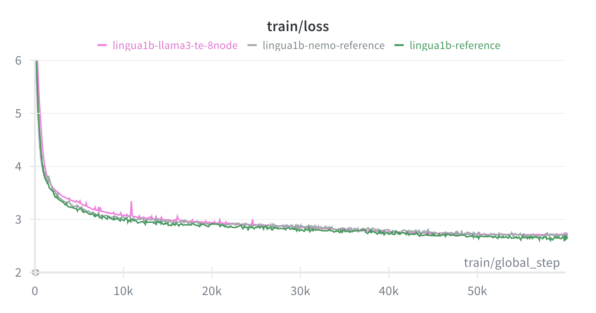

# TransformerEngine-accelerated Llama 3 training with native PyTorch training loop

This folder demonstrates how to train TE-accelerated Llama 3 with a native PyTorch training loop, including sequence
packing and FP8 precision, using fully sharded data parallel (FSDP) for distributed training. This recipe is configured
for genomic sequences using a custom nucleotide tokenizer.

## How to use this recipe

This folder contains an independent, minimal training example. It does not depend on any other code in the top-level
bionemo-framework repository. You can download a zipped directory of this folder alone by clicking
[here](https://download-directory.github.io?url=https://github.com/NVIDIA/bionemo-framework/tree/main/bionemo-recipes/recipes/llama3_native_te&filename=llama3-native-te).

### How to deploy this recipe on cloud providers

🚧 Under development

## Supported Models and Training Features

| Model                                    | BF16 | FP8<sup>[1]</sup> | THD Input Format | FP8 with THD Input Format | MXFP8<sup>[2]</sup> | Context Parallelism |
| ---------------------------------------- | ---- | ----------------- | ---------------- | ------------------------- | ------------------- | ------------------- |
| [Llama 3](../../models/llama3/README.md) | ✅   | ✅                | ✅               | 🚧                        | 🚧                  | 🚧                  |

✅: Supported <br/>
🚧: Under development <br/>
❌: Not supported <br/>

\[1\]: Requires [compute capability](https://developer.nvidia.com/cuda-gpus) 9.0 and above (Hopper+) <br/>
\[2\]: Requires [compute capability](https://developer.nvidia.com/cuda-gpus) 10.0 and 10.3 (Blackwell), 12.0 support pending <br/>

### Installing Dependencies

The easiest way to get started with this recipe is to use the provided Dockerfile, which uses the latest NVIDIA PyTorch
base image to provide optimized versions of PyTorch and TransformerEngine. To build the container, run:

```bash
docker build -t llama3_native_te .
```

To run the container, run:

```bash
docker run -it --gpus all --network host --ipc=host --rm -v ${PWD}:/workspace/bionemo llama3_native_te /bin/bash
```

Alternatively, the dependencies can be installed manually in an environment with CUDA support. See `requirements.txt` for the list of dependencies.

### Performance Benchmarks

<p align="center">
  
  
</p>

We compared the performance and convergence of this Llama3 recipe (with FSDP2) against NeMo 2.0
(https://github.com/NVIDIA-NeMo/NeMo) and the [facebookresearch/lingua](https://github.com/facebookresearch/lingua)
implementation on the DCLM Baseline 1.0 dataset. See [Training on Natural Language Data (Lingua
Reproduction)](#lingua-reproduction) for more details. The figure above shows similar loss convergence and step time to
the NeMo 2.0 training example, and the following table shows downstream performance on various tasks using the
[lm-eval](github.com/eleutherai/lm-evaluation-harness) library. The variation in training step time every 10,000 steps
are due checkpointing, further work will be done to improve training step time stability.

| name                | arc_challenge | arc_easy | boolq | copa | hella_swag | piqa  | winogrande |
| ------------------- | ------------- | -------- | ----- | ---- | ---------- | ----- | ---------- |
| Llama3 1B (Lingua)  | 32            | 69.32    | 62.94 | 77   | 47.16      | 73.34 | 63.06      |
| Llama3 1B (NeMo2)   | 32.34         | 67       | 59.79 | 78   | 59.09      | 74.43 | 59.83      |
| Llama3 1B (Recipes) | 30.63         | 65.57    | 55.6  | 80   | 44.57      | 73.29 | 58.72      |

Models were trained on 64 NVIDIA H100 GPUs with a micro batch size of 4 and a context length of 4096 for 60,000 steps.
Training was performed with BF16 precision.

### Distributed Training

This recipe supports distributed training using DDP and FSDP2, shown in two separate training entrypoints:

- [Distributed Data Parallel (DDP)](https://docs.pytorch.org/docs/stable/generated/torch.nn.parallel.DistributedDataParallel.html), shown in `train_ddp.py`
- [Fully Sharded Data Parallel 2 (FSDP2)](https://docs.pytorch.org/docs/stable/distributed.fsdp.fully_shard.html), shown in `train_fsdp2.py`

## Commands to Launch Training

To run single-process training on one GPU, run:

```bash
python train_fsdp2.py  # or train_ddp.py
```

To run multi-process training locally on 2+ GPUs, run (e.g. 2 GPUs):

```bash
torchrun --nproc_per_node=2 train_fsdp2.py  # or train_ddp.py
```

Multi-Node training is supported with both strategies.

### FP8 Training

To run training with FP8, enable it by overriding the `fp8_config.enabled=true` configuration parameter. Additional FP8
configuration parameters, including switching to `MXFP8BlockScaling`, can be set via the hydra configuration.

```bash
python train_fsdp2.py --config-name L0_sanity fp8_config.enabled=true
```

### Sequence Packing (THD input format)

Sequence packing is handled via a padding-free collator (in `collator.py`) that provides input arguments (e.g.
`cu_seq_lens_q`) needed for padding-free attention. To enable sequence packing, set `use_sequence_packing=true`
in the hydra configuration.

```bash
python train_fsdp2.py --config-name L0_sanity use_sequence_packing=true
```

### FP8 and Sequence Packing

To combine FP8 training with sequence packing, the number of unpadded input tokens must be a multiple of 16. The data
collator will automatically pad packed sequences to the maximum number of tokens per batch.

```bash
python train_fsdp2.py --config-name L0_sanity \
  fp8_config.enabled=true \
  use_sequence_packing=true
```

## Downloading Pre-Training Data For Offline Training

This recipe is configured to use genomic sequences. The default configuration uses a local test file
`test_genomic_sequences.parquet`.

For large-scale training, you can point the dataset configuration to a directory containing Parquet files or a Hugging
Face dataset, e.g., for the DCLM Baseline 1.0 dataset:

```bash
hf download mlfoundations/dclm-baseline-1.0 \
 --repo-type dataset --include 'global-shard_01_of_10/*' \
 --local-dir /path/to/download/directory

python train_fsdp2.py --config-name L0_sanity \
  dataset.load_dataset_kwargs.path=/path/to/download/directory
```

## Training on Natural Language Data (Lingua Reproduction) {#lingua-reproduction}

We provide a configuration to reproduce the Llama-3.2-1B training experiments from [Meta
Lingua](https://github.com/facebookresearch/lingua), using the [DCLM Baseline
1.0](https://huggingface.co/datasets/mlfoundations/dclm-baseline-1.0) dataset.

To launch this training, use the `L2_lingua_1b` configuration:

```bash
python train_fsdp2.py --config-name L2_lingua_1b
```

This configuration:

- Uses the `meta-llama/Llama-3-8B` tokenizer (requires Hugging Face login).
- Streams the `mlfoundations/dclm-baseline-1.0` dataset.
- Sets up training parameters to match the Lingua 1B baseline.

Note: Ensure you have authenticated with Hugging Face (`huggingface-cli login`) to access the tokenizer if it requires
gated access, or update the config to use a public Llama 3 tokenizer.

## Saving and Loading Checkpoints

To enable checkpoint saving, ensure that `checkpoint.ckpt_dir` is set to a writable directory. Checkpointing frequency is
controlled by the `checkpoint.save_every_n_steps` configuration parameter.

```bash
python train_fsdp2.py --config-name L0_sanity \
  checkpoint.ckpt_dir=/path/to/ckpt_dir \
  checkpoint.save_every_n_steps=100
```

To enable checkpoint loading, set `checkpoint.resume_from_checkpoint=true` to resume from the latest checkpoint.

```bash
python train_fsdp2.py --config-name L0_sanity \
  checkpoint.ckpt_dir=/path/to/ckpt_dir \
  checkpoint.resume_from_checkpoint=true
```

We also show how to export a final model at the end of training, which is suitable for uploading to the Hugging Face Hub
or for local inference as a more durable format than torch distributed checkpoints. To enable this, set
`checkpoint.save_final_model=true` in the hydra configuration. The resulting model will be saved to the `final_model`
directory within the checkpoint directory.

## Saving Dataloader State with `StatefulDataLoader`

These examples show how to save and resume your dataloader by passing the dataloader instance to our `save_checkpoint_*`
and `load_checkpoint_*` functions using the `StatefulDataLoader` class from `torchdata`. See `checkpoint.py` for
implementation details.

## Running Inference with the Trained Model

Models can be loaded from the final checkpoint directory using the `AutoModelForCausalLM` method (or
`NVLlamaForCausalLM` if using TE layers directly, though standard HF loading works if the `config.json` is updated to
include an `auto_map` entry for `modeling_llama_te.NVLlamaForCausalLM` and the custom forward pass is packaged in the
checkpoint directory).

If you trained with TE layers (which is the default in this recipe), you can use the `NVLlamaForCausalLM` class for
inference, which supports high-performance generation with TE-provided `InferenceParams` key-value cache class.

```python
import torch
from transformers import AutoTokenizer
from transformer_engine.pytorch.attention import InferenceParams
from modeling_llama_te import NVLlamaForCausalLM, NVLlamaConfig

# Load the model configuration and weights
config = NVLlamaConfig.from_pretrained("path/to/final_model")
model = NVLlamaForCausalLM.from_pretrained("path/to/final_model", config=config)
tokenizer = AutoTokenizer.from_pretrained("./tokenizers/nucleotide_fast_tokenizer")

model.to("cuda")
model.eval()

# Example genomic sequence
sequence = "ACGTACGT"
inputs = tokenizer(sequence, return_tensors="pt").to("cuda")

# Setup inference parameters for efficient generation
past_key_values = InferenceParams(
    max_batch_size=1,
    max_sequence_length=256,
    num_heads_kv=model.config.num_key_value_heads,
    head_dim_k=model.config.hidden_size // model.config.num_attention_heads,
    dtype=torch.bfloat16,
    qkv_format="thd",
    max_ctx_len=256,
)

for layer_number in range(1, model.config.num_hidden_layers + 1):
    past_key_values.allocate_memory(layer_number)

# Generate
with torch.no_grad():
    output_ids = model.generate(
        **inputs, max_new_tokens=16, use_cache=True, past_key_values=past_key_values
    )

generated_text = tokenizer.batch_decode(output_ids, skip_special_tokens=True)
print(generated_text)
```

### Converting to Hugging Face Format

If you want to convert the trained TE model back to a standard Hugging Face `LlamaForCausalLM` (e.g., to use with vLLM
or SGLang), you can use the provided conversion script in `../../models/llama3/convert.py`.

```python
import torch
from transformers import AutoTokenizer
from modeling_llama_te import NVLlamaForCausalLM, NVLlamaConfig
from convert import convert_llama_te_to_hf  # Import from ../../models/llama3/convert.py

# Load TE model
config = NVLlamaConfig.from_pretrained("path/to/final_model")
model_te = NVLlamaForCausalLM.from_pretrained("path/to/final_model", config=config)

# Convert to HF
model_hf = convert_llama_te_to_hf(model_te)

# Save HF model
model_hf.save_pretrained("path/to/hf_converted_model")
tokenizer = AutoTokenizer.from_pretrained("./tokenizers/nucleotide_fast_tokenizer")
tokenizer.save_pretrained("path/to/hf_converted_model")
```

Once converted, the model can be loaded by any library that supports Llama 3, such as
[vLLM](https://github.com/vllm-project/vllm) or [SGLang](https://github.com/sgl-project/sglang).

```bash
# Example vLLM usage
vllm serve path/to/hf_converted_model
```

## Developer Guide

### Running tests

To run tests locally, run `recipes_local_test.py` from the repository root with the recipe directory as an argument.

```bash
./ci/scripts/recipes_local_test.py bionemo-recipes/recipes/llama3_native_te/
```

### Development container

To use the provided devcontainer, use "Dev Containers: Reopen in Container" from the VSCode menu, and choose the
"BioNeMo Recipes Dev Container" option. To run the tests inside the container, run `pytest -v .` in the recipe
directory.

### Hydra Tips

[Hydra](https://hydra.cc/) is a powerful configuration management library for Python. This recipe uses Hydra to manage
training configurations, allowing for easy modification of training hyper-parameters and model settings.

Configuration parameters can be overridden from the command line, e.g.
`python train_fsdp2.py --config-name L0_sanity fp8_config.enabled=true`.
